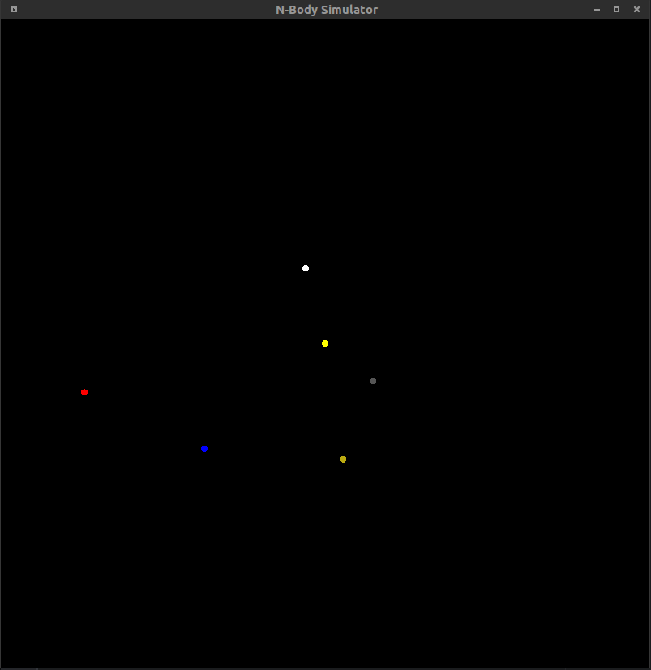

# N-Body: a Lightweight (~1000 LoC) N-Body Simulator

This is n-body simulator I'm currently writing in C. It solves the n-body system
numerically using the midpoint formula and Newton's law of universal
gravitation.

# How to Use

## Cloning

You can clone the repository with
`git clone https://github.com/davidretler/N-Body.git`.

## Dependencies

This program depends on:

 * Glut (package `freeglut3-dev`)
 * GCC (package `gcc`)

 N-Body was built and tested on Ubuntu Linux 15.04 but should run on any Linux
 platform with the dependencies installed. N-Body *might* work with Cygwin on
 Windows, but I have not tested it at this point. N-Body makes use of Linux
 system calls for sleeping during frames, and thus currently will not run
 natively on Windows. This may change in the future.

## Building
To build the cli version use

    make cli
    ./nbody > data.csv

To build the GUI version use

    make gui
    ./nbody-gui

## Running

You can run the program using a custom list of bodies by typing `./nbody planets`
where `planets` is a properly-formatted file containing planet data.

Note that the gui version is likely only to run on Unix systems. GLUT is is
required to build and run the gui version.

## Output

The program will print a `.csv` file to standard out that contains on each row the following data:

    Planet_1_ID, pos_1, pos_2, pos_3, Planet_2_ID, pos_1, pos_2, pos_3,...

with successive rows representing different points in time. You can pipe the
output to a file, to view in an external program. I suggest viewing the data in
 either LibreOffice Calc or Microsoft Excel.

If you're running the program in gui mode, then you should see a window with the
planets in it, updating at 60 FPS. Here is a screenshot for example, with the
Solar System (plus a random extra body), zoomed in to a scale of 2 AU:

## Planet list

If you make a file called `planets` which contains initial planetary data, run
the program with `./a.out /path/to/planets` and the program will initialize the
universe with that data. Each body should have a it's own line formatted as:

    NAME,POS_1,POS_2,POS_3,VEL_1,VEL_2,VEL_3,MASS

For example, to add the Earth and the Sun:

    Earth,1.52e11,0,0,0,29316,0,5.972e24
    Sun,0,0,0,0,0,0.0,1.988435e30

Note that the numerical value of every quantity is given in SI (MKS) units.

An optional 9th value has beed added: color. To color a planets just add a 9th
entry containing the color in hex form. For example, this makes the Earth blue:

    Earth,1.52e11,0,0,0,29316,0,5.972e24,0000FF

# Features to Add

I will be attempting to add the following features:

* Allow for custom lists of bodies [✓]
* Output Plotting [✓]
* General polishing

# TODO

* Move planet parser out of main

# Current Issues

* ~~The sun appears to be slowing drifting from the center, but only when using
the midpoint algorithm (which *should* be more accurate)~~ this has been fixed!
